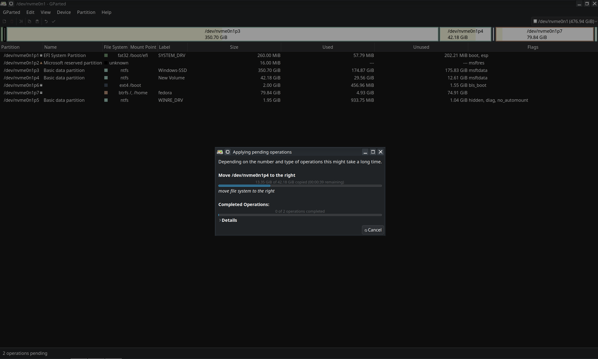
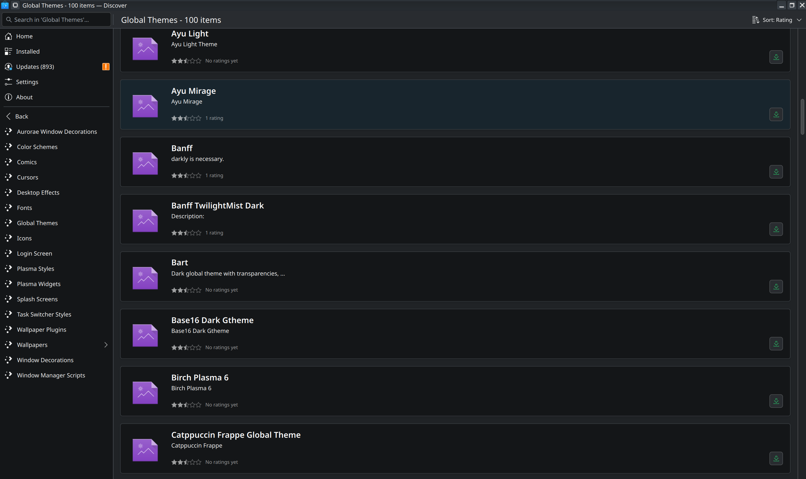
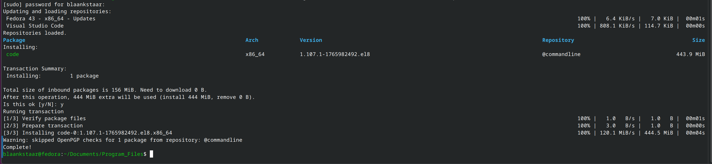

# Choosing the Right Linux Distribution: My Journey to Fedora KDE

## Table of Contents
1. [Introduction](#introduction)
2. [How to Choose Your Linux Distribution](#how-to-choose-your-linux-distribution)
3. [Challenges I Faced](#challenges-i-faced)
4. [Solutions and Workarounds](#solutions-and-workarounds)
5. [Key Learnings](#key-learnings)
6. [Conclusion](#conclusion)

---

## Introduction

Linux as an OS was at the back of my mind for quite sometime. Pretty much I was sure that I need to use Linux and explore it, but the push was when most of my friends started using Linux and I got caught in the FOMO. 
I would say this is a pretty good decision as of now.
Let's begin the article.

---

## How to Choose Your Linux Distribution
Selecting the best Distribution was quite difficult as whenever I looked at one I could see that the grass was greener on the other side. Selecting best distro is exhausting. So now you might think how I selected Fedora as my system?

Simple extensive YouTube doom scrolling (SMILING EMOJI). Nope just understanding your basic needs, asking following questions helped me a lot

1. What is your use case?
2. How comfortable are you with command line? *Beginners must consider this point thoroughly*
3. What Environment appeals you the most?
4. Do you prefer stability or features?

answering these question step by step helped me understand what I should opt for...
for my audience here is a list that I have curated.

### Popular Distribution Categories

**Beginner-Friendly:**
- Ubuntu (balance of ease and features)
- Linux Mint (intuitive and straightforward)
- ElementaryOS (elegant and simple)

**Advanced/Customizable:**
- Fedora (cutting-edge, rolling updates)
- Arch Linux (minimal, highly customizable)
- NixOS (declarative, reproducible)

**Stable/Production:**
- Debian (rock-solid stability)
- CentOS (enterprise-focused)
- RHEL (Red Hat Enterprise Linux)

**IMPORTANT**
The desktop environment significantly impacts your experience. KDE Plasma offers extensive customization, GNOME provides simplicity, and XFCE offers lightweight efficiency.


WAIT WHAT where did this KDE, GNOME and XFCE come from? what is it?
Yes guys, I got you covered....
**KDE** KDE is basically highly customizable and you can do many changes to the environment. It is feature rich and often resembles WINDOWS OS or MAC OS based on your preference. This is *Resource Intensive* without any doubt but more efficient then GNOME.
IDEAL for customization freaks, power users and curious minds.

**GNOME** GNOME is minimal, clean and smooth. Though the trade-off is that it is not as customizable as KDE, it sure does not lack behind it in any way possible. This runs smoothly / has more customizations for touchscreen based devices.
IDEAL for  beginners who are still in the exploration phase and users with touchscreens.

**XFCE** XFCE is good for legacy devices, why? because it is lightweight fast and gets the work done. This is the least customizable of the three.
IDEAL for people with old devices.

---

## Challenges I Faced

### 1. **BitLocker Encryption and Dual-Booting**

The biggest hurdle in my transition was Windows' BitLocker encryption. I wanted to dual-boot Windows and Linux on the same machine, but BitLocker locked me out from properly resizing partitions and preparing the disk for a Linux installation.

**The Problem:**
- BitLocker encrypts the entire drive, making it impossible to resize partitions from Windows Disk Management
- BIOS/UEFI settings were conflicting with the encryption
- Attempting to create a Linux partition while BitLocker was active risked data corruption

### 2. **Learning the Command Line**

Coming from a GUI-centric Windows environment, I still rely heavily on graphical tools in Linux. However, I quickly realized that:
- Many powerful tasks are only accessible through the terminal
- GUI tools often have limitations compared to command-line utilities
- Scripting and automation require terminal proficiency

---

## Solutions and Workarounds

### Removing BitLocker:
I am attaching the steps I did along with the prerequisites.

**Prerequisites:**
- Admin access to your Windows account
- A backup of important data
- Patience (the process can take 1-2 hours depending on drive size)

**Steps:**

1. OPEN WINDOWS POWERSHELL
  - Run as administrator

2. Type following commands

  ```bash
  $ manage-bde -status
    $ manage-bde -unlock "NAME:"  *This command unlocks the locker and decrypts it* 
    $ manage-bde -autounlock -ClearAllKeys "Name:" *Removes any unlocks left that can block the drive from being fully unlocked*
  ```

  after doing this open Disk partitioning software and then arrange space as required.



### Mastering the Command Line

The transition from GUI to CLI was transformative. Here's what I learned:

**Essential Commands for Daily Tasks:**

- **File Management:**
  ```bash
  # Navigate directories
  cd /path/to/directory
  
  # List files with details
  ls -la
  
  # Copy/Move files
  cp source destination
  mv oldname newname
  
  # Create/Remove directories
  mkdir newfolder
  rmdir emptyfolder
  ```

- **System Information:**
  ```bash
  # Check disk space
  df -h
  
  # View running processes
  top
  ps aux
  
  # Check system info
  uname -a
  neofetch
  ```

- **Package Management** (Fedora):
  ```bash
  # Install packages
  sudo dnf install package-name
  
  # Update system
  sudo dnf upgrade
  
  # Search for packages
  dnf search keyword
  ```

- **File Editing:**
  ```bash
  # Using nano (beginner-friendly)
  nano filename
  
  # Using vim (powerful, steeper learning curve)
  vim filename
  ```
### Choosing Fedora KDE: The Perfect Match

After experimenting with several distros, I settled on **Fedora with KDE Plasma** for these reasons:

- Cutting-edge software (latest versions, rolling updates)
- Strong community and excellent documentation
- Excellent package manager (DNF)
- Professional and developer-friendly
- Regular release cycle (every 6 months)

**Why KDE Plasma:**
- **Extreme Customization:** Every aspect can be tweaked
- **Global Menu:** Organize applications by category
- **Activities:** Create virtual workspaces with different purposes
- **Theming:** Comprehensive color schemes and widget customization
- **Productivity Features:** Excellent window management and keyboard shortcuts
- **Professional Appearance:** Looks polished and modern
- **Performance:** Responsive and lightweight compared to GNOME


You can customize many things i am listing a few below:
- **Panel Layout:** Multiple panels, custom positioning
- **Application Launcher:** Different styles and configurations
- **Desktop Widgets:** Add custom widgets to your desktop
- **Window Decoration:** Choose from numerous themes
- **Keyboard Shortcuts:** Bind any command to key combinations
- **Virtual Desktops:** Create and organize multiple workspaces



---

## Key Learnings

### 1. **Preparation is Essential**
Before switching, understand what you're getting into. Backup your data, research your chosen distro, and prepare for a learning curve.

### 2. **Embrace the Command Line**
Don't view the terminal as intimidating—it's your most powerful tool. Invest time in learning it early; the payoff is enormous.

### 3. **Distro Choice Matters**
Your experience with Linux is heavily influenced by your distro choice. Don't settle for the first one; try a few live USBs.

### 4. **Customization Enhances Productivity**
A desktop environment tailored to your workflow dramatically improves efficiency and enjoyment.

### 5. **Community Support is Invaluable**
Fedora and KDE communities are welcoming and helpful. Don't hesitate to ask questions.

### 6. **BitLocker Removal is Worth It**
The initial effort to disable BitLocker and prepare your system properly pays dividends in the long run.

---

## Setting Up Your Development Environment

Once you've successfully installed Fedora KDE and configured your system, you'll want to set up essential development tools. Here are some key applications:


The above image just shows what I did to install once I had downloaded .rpm package as Fedora is RedHat linux based distro.
GO to the official website and then download the package and save it into a directory.

## Github installation
Fedora does not take the regular apt commands as it is a Debian based system. I was not aware of this difference, till I did not google "WHY SUDO APT does not work on Fedora".
The answer was simple both have package managers but under different names like DNF (Danified YUM) & APT (Advanced Package tool).
Below I am attaching the command that I used ofc... by referencing the WEB.

```bash
$ sudo dnf install git -y .

after Installing Git I did git --version
```

## Conclusion

My journey from a Windows user to a Fedora KDE enthusiast involved overcoming technical challenges, learning new tools, and discovering the power and flexibility that Linux offers. While BitLocker and the initial command-line learning curve were obstacles, they weren't insurmountable—and the freedom and customization I gained were absolutely worth the effort.

If you're considering Linux:
- Choose a distro that matches your skill level and goals
- Embrace the command line—it's a game-changer
- Select a desktop environment that resonates with you
- Don't be afraid to experiment and switch distros if needed

Welcome to Linux. You won't regret it.

---

**Have you switched to Linux? What were your biggest challenges? Share your story in the comments below!**
