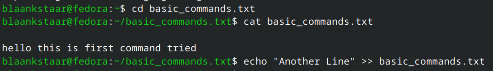
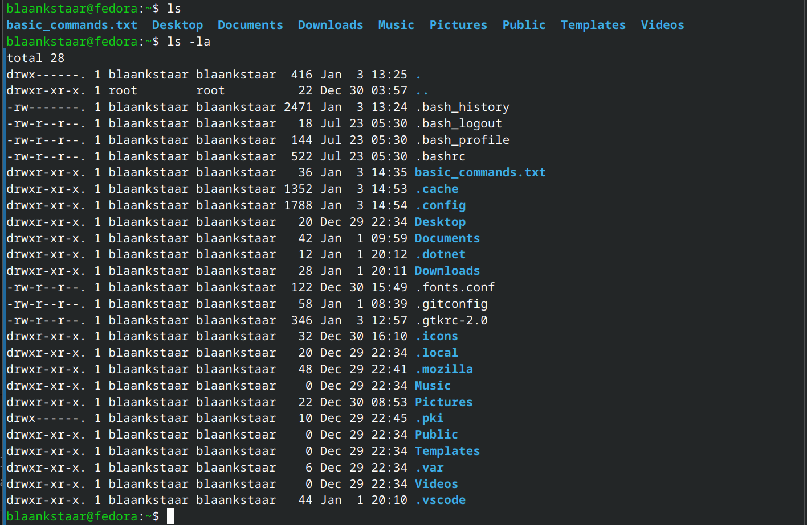
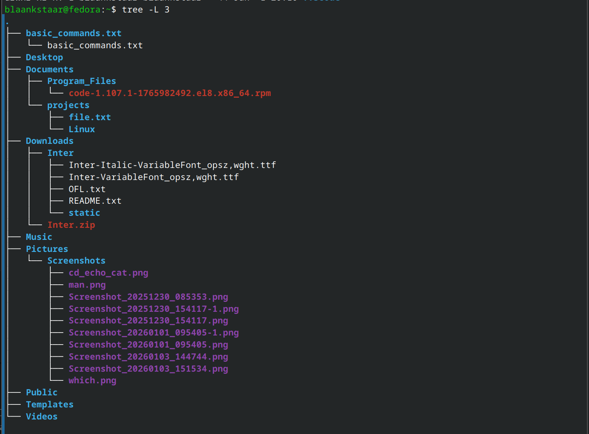
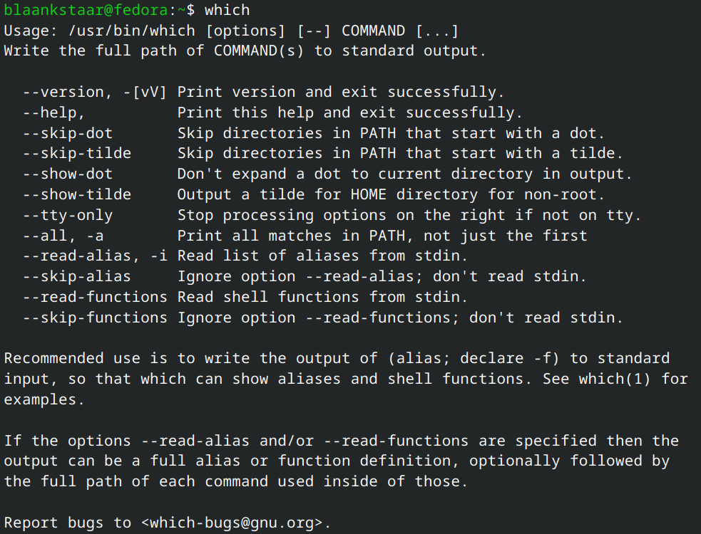
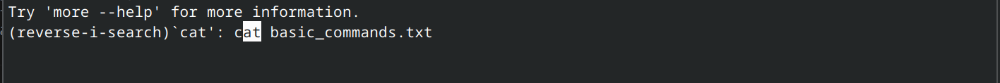

# Mastering Basic Linux Commands: A Practical Field Guide

## Table of Contents
1. [Introduction](#introduction)
2. [How to Use This Guide](#how-to-use-this-guide)
3. [Navigation and Paths](#navigation-and-paths)
4. [Looking at Files and Directories](#looking-at-files-and-directories)
5. [Creating and Editing Files](#creating-and-editing-files)
6. [Copy, Move, and Remove](#copy-move-and-remove)
7. [Archiving and Compression](#archiving-and-compression)
8. [Package Management Basics](#package-management-basics)
9. [Networking and Transfers](#networking-and-transfers)
10. [Processes and System Info](#processes-and-system-info)
11. [Everyday Quality-of-Life Tips](#everyday-quality-of-life-tips)

---

## Introduction

The terminal is where Linux shines. In this article, I document the essential commands I've learned and use regularly. Whether you're exploring Linux for the first time or looking to sharpen your skills, these commands are fundamental to your daily workflow. Feel free to follow along and practice on your own system.

---

## How to Use This Guide

Each code block is ready to copy and paste. Replace paths and filenames with your own as needed. Commands that modify the system use `sudo` where appropriate. Where you see angle brackets `<>`, substitute your own values. All screenshots are available in the images/ folder and show real command output.

---

## Navigation and Paths

```bash
# Print current directory, it shows you your current working directory.
pwd

# Change directory, The CD command is basically used to change your active directory to one you want to target.
cd /path/to/place
cd ..          # up one level, basically go to more high level view of the directory
# lets say Documents/Linux/information.
# if we do cd .. we will get a high level view i.e. Documents/Linux
cd ~           # Directly move back to home directory.

# List contents
ls             # lists files and directories only (hidden files not shown)
ls -la         # shows all files with full details, including hidden ones
```





---

## Looking at Files and Directories

```bash
# View file quickly
cat file.txt
head -n 20 file.txt
tail -n 20 file.txt

# Page through output
less file.txt

# Show tree (install tree if missing)
tree -L 2
```





---

## Creating and Editing Files

```bash
# Create empty file
touch notes.txt

# Make directories (including parents)
mkdir projects
mkdir -p projects/demo/assets

# Edit files (pick your editor)
nano notes.txt
vim notes.txt

# Quick echo into a file (overwrites)
echo "Hello Linux" > hello.txt
# Append instead of overwrite
echo "Another line" >> hello.txt
```

---

## Copy, Move, and Remove

```bash
# Copy files and folders
cp source.txt destination.txt
cp -r folder/ backup_folder/

# Move or rename
mv oldname.txt newname.txt
mv file.txt ~/Documents/

# Remove carefully
rm file.txt
rm -r old_folder
# Add -i for interactive safety
rm -ri old_folder
```

---

## Processes and System Info

```bash
# Current user
whoami
id

# Clean the screen
clear

# Running processes
top
htop        # if installed
ps aux      # snapshot view

# Disk and memory
df -h
free -h

# Kernel and system details
uname -a
cat /etc/os-release
```


---

## Everyday Quality-of-Life Tips

These productivity tricks will speed up your terminal work significantly.

- Use tab completion to avoid typing long paths.
- Press Ctrl+R to search command history; type a few letters and press Enter.



- Chain commands with && so the second runs only if the first succeeds.
- For long outputs, add | less to scroll comfortably.
- Set aliases in ~/.bashrc or ~/.zshrc, for example: alias ll="ls -la".

Remember: the terminal is your most powerful tool. Master it, and you'll unlock the full potential of Linux.

---

**Ready to dive deeper? Keep practicing, and don't fear the command line. You've got this!**

Happy hacking!
