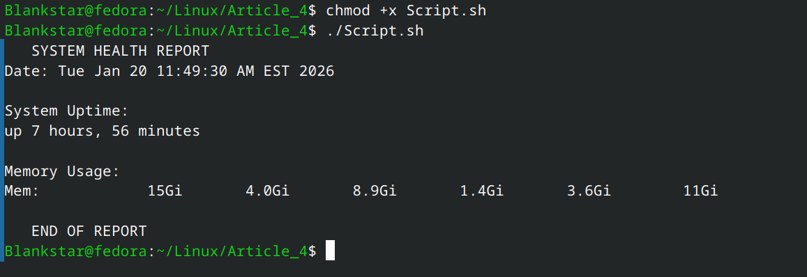
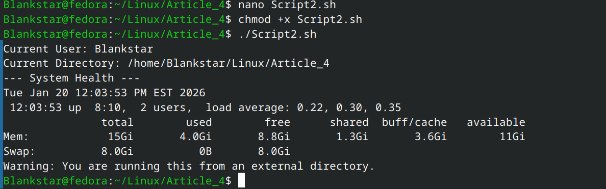

# Article 4: System Health Check & Bash Logic
1. The Theory: Why we use these symbols

Before looking at the commands, it is important to understand the syntax that makes Bash work.
The Shebang (#!/bin/bash)

*The first line of any script is #!/bin/bash.*

    #!: This is a "magic" marker that tells Linux this file is an executable script.

    /bin/bash: This is the absolute path to the Bash program. By including this, you ensure that even if a user is using a different shell (like zsh), the system will switch to Bash to run your commands correctly.

*The $ Sign: Expansion vs. Literals*

This is the most important concept in Bash. Bash treats almost everything as "plain text" unless you tell it otherwise.

    Literal Text: echo myname

        Output: myname

        Why: Bash sees "myname" as just a string of letters.

    Variable Expansion: echo $myname

        Output: Blankstar (or whatever value is stored).

        Why: The $ tells Bash to "Expand" the variable—meaning "Go find the value inside this container and put it here."

Command Substitution $(...)

If you want to use the result of a command (like the output of pwd) inside a sentence or a comparison, you wrap it in $( ).

    Example: echo "I am in $(pwd)"

    Without the $(), Bash would literally print the letters "p-w-d" instead of your actual folder path.

2. Command Glossary

*Command 	What it does	      Why the "Flags" matter*
pwd	 Print Working Directory  Shows exactly where you are in the file system.
ls -la  	List files	 -l shows details (size, date); -a shows hidden files.
free -h 	Check Memory	 -h stands for Human Readable (converts bytes to GB/MB).
uptime	    System Longevity	 Shows how long the computer has been on and the "load" (stress).
date    	Timestamp	 Useful for logging when a health check was performed.

3. The Implementation
[Script.sh](Article_4/Script.sh)
[Script2.sh](Article_4/Script2.sh)
4. The output
Below is a screenshot demonstrating the expected output of the script:

*Note: The image above shows the terminal output after running the health check.*
