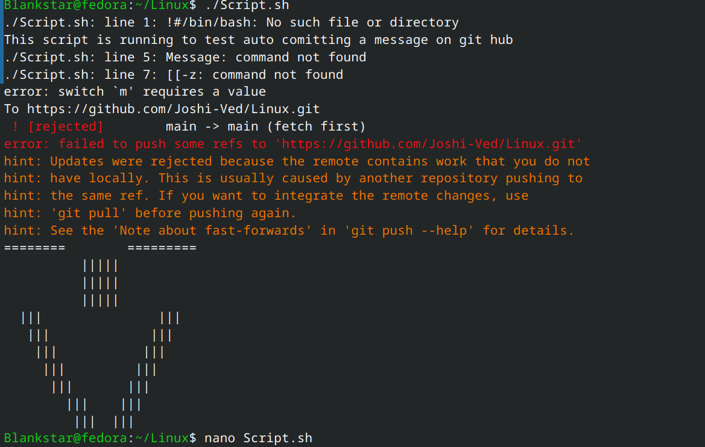
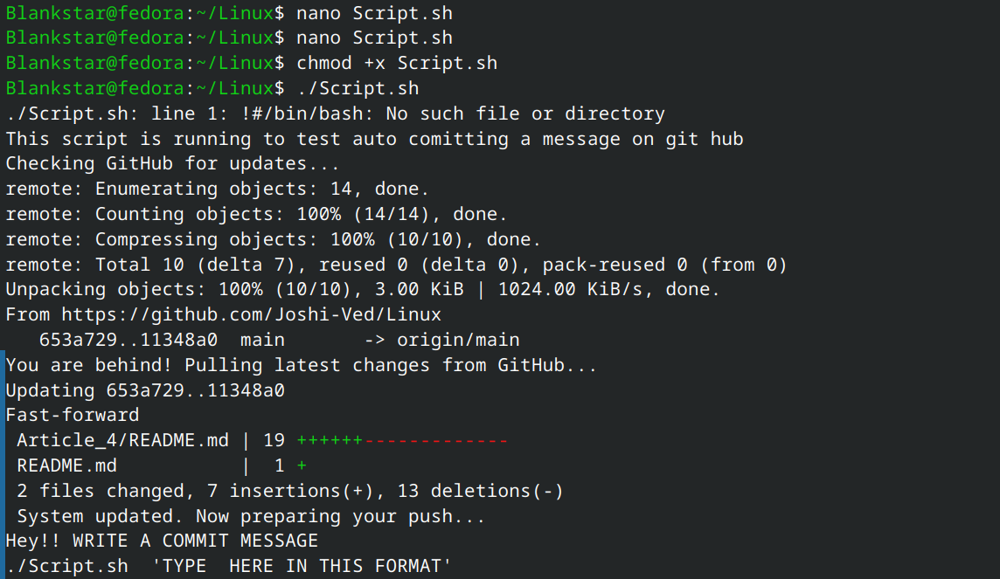
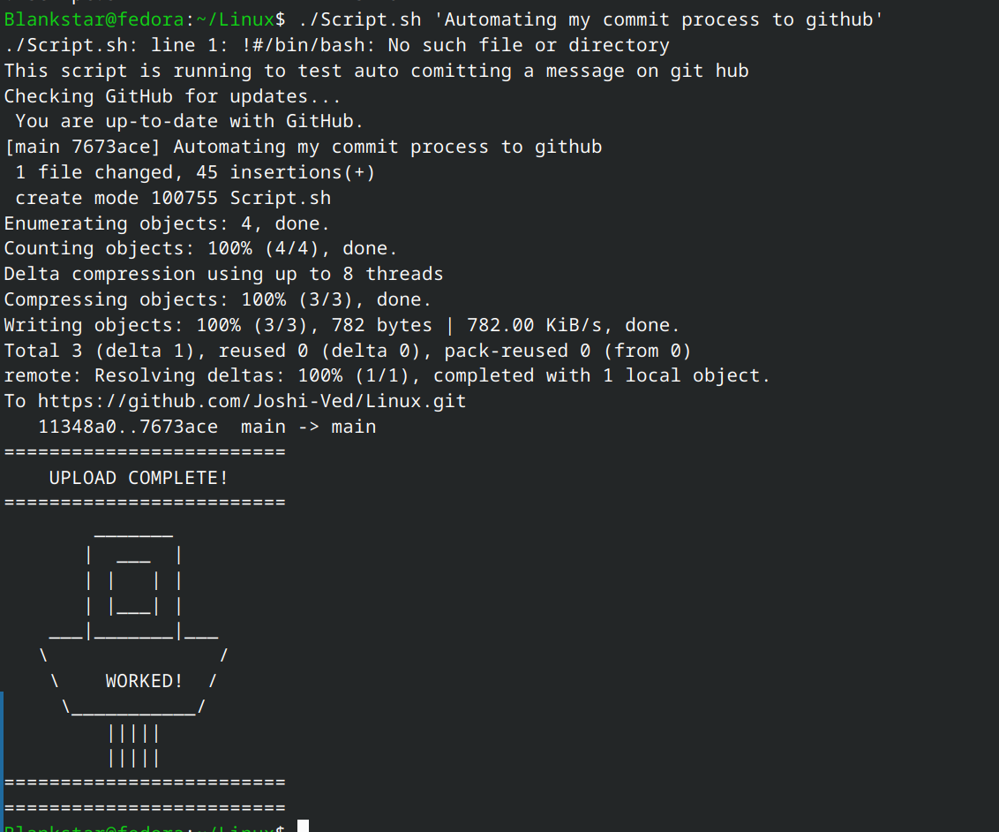
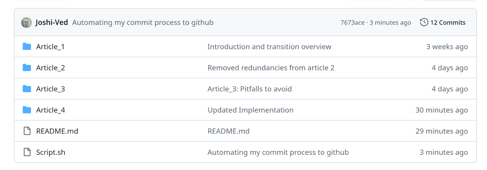
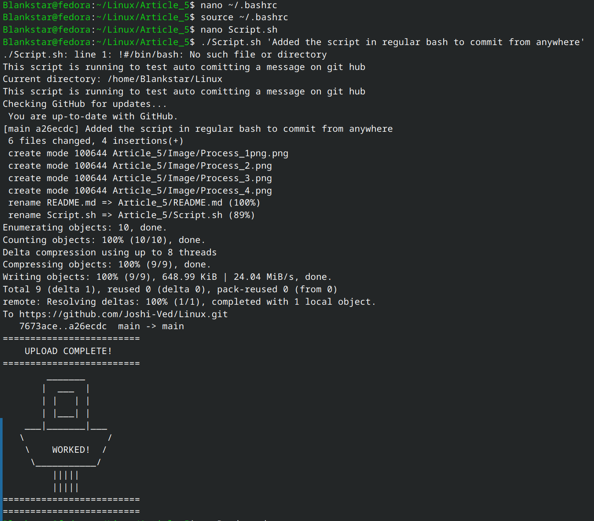

**Article 5: Automating the Dev Workflow**

---

## 1. The Problem

As a developer, the repetitive cycle of `git add`, `git commit`, and `git push` is time-consuming and prone to errors. If you forget to pull before you push, GitHub rejects your work. This project aims to solve that by creating a Smart Automation Script.

---

## 2. Git Synchronization

- `git fetch`: A "look-before-you-leap" command that checks the GitHub server for updates without changing local files.
- **STATUS == _"behind"_**: Using wildcards to detect if the remote server has code that we don't have locally yet.

---

## 3. The Implementation: Script.sh

This script handles the entire lifecycle of a code update:
- Jumps to the project directory.
- Checks GitHub for remote changes.
- Pulls if we are behind.
- Validates that a commit message was provided.
- Pushes the code with a custom success message and ASCII art.

[**Script.sh**](./Script.sh)

---

## 4. System-Wide Integration (The Alias)

To make this script a "Global Command," we integrated it into the `.bashrc` file:

```bash
# Added to ~/.bashrc
alias upload='/home/Blankstar/Linux/Article_5/Script.sh'
```

Now, by simply typing `upload "message"`, the entire process happens automatically from any folder in the system.

---

## 5. Visual Process & Output







---

## 6. Conclusion

By combining Bash scripting with Git logic and system aliases, I turned a 4-step manual process into a single-word command. This not only saves time but ensures the local repository is always synced with the remote server before any changes are uploaded.
